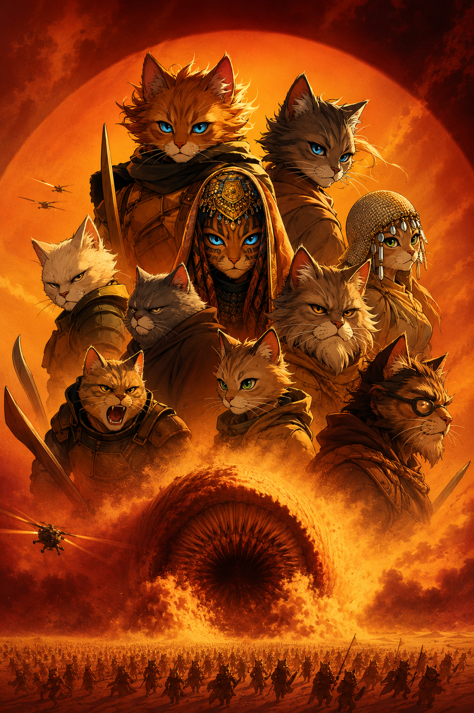
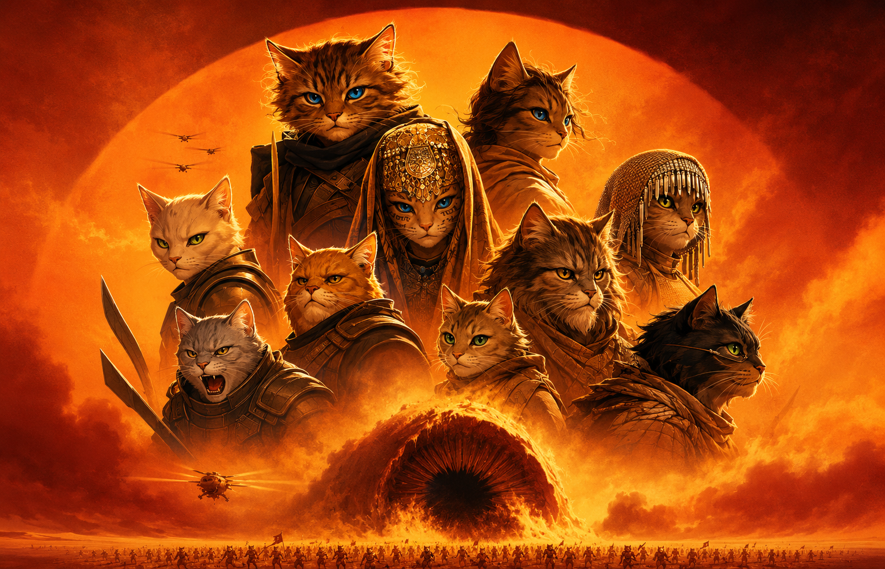
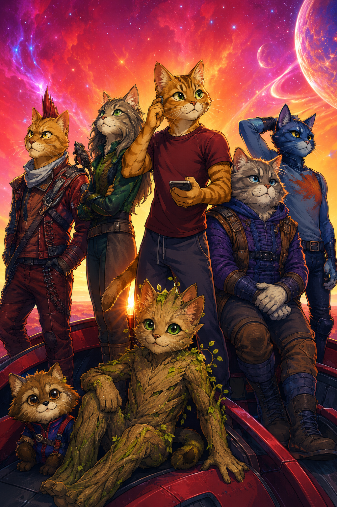
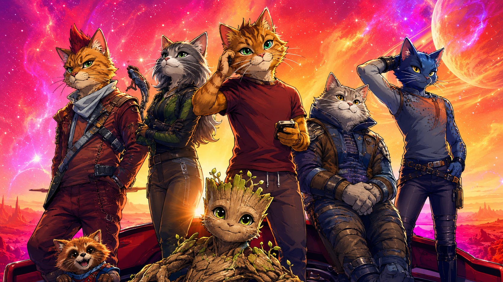
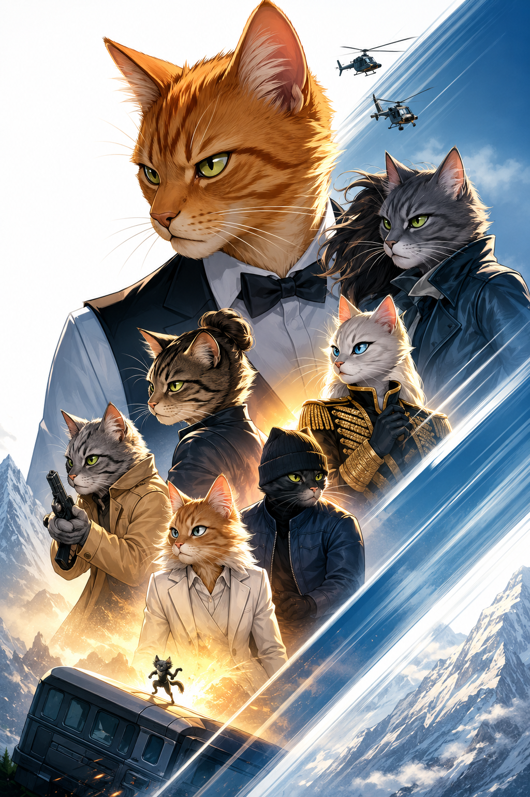
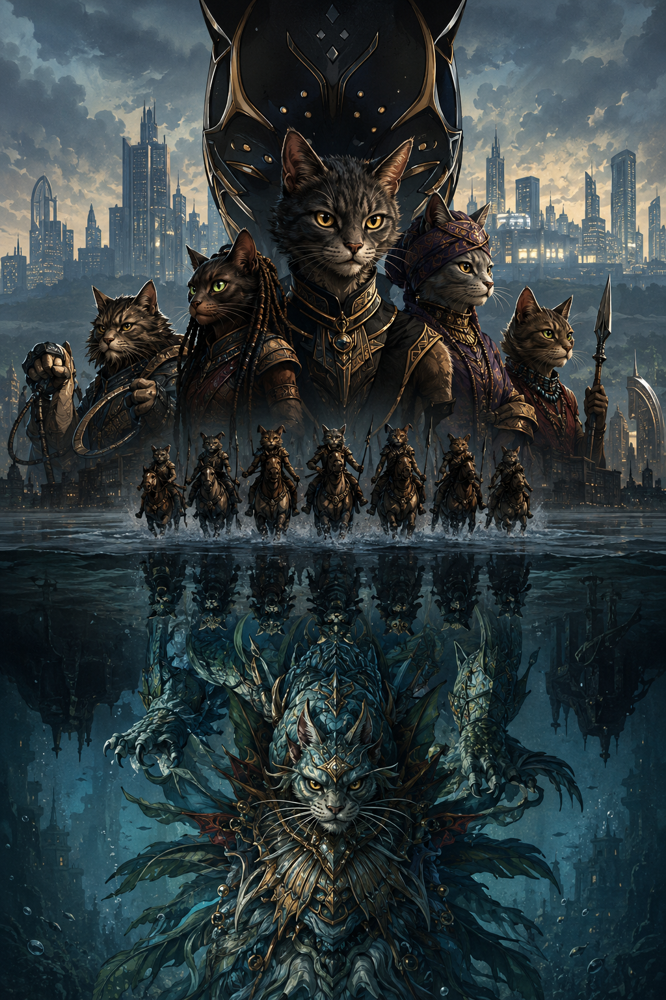
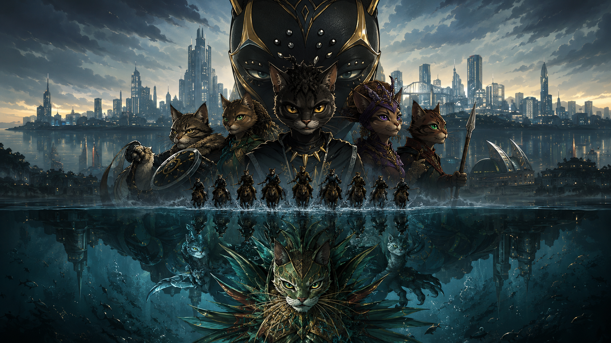

# Cinema 電影訂票系統｜Java Spring Boot 後端作品集

Version: v1.0 Portfolio Release

電影院訂票 side project，技術棧為 Spring Boot + Thymeleaf + MySQL。

## 專案現況（以目前程式碼為準）

- Spring Boot：`3.5.11`（`pom.xml`）
- Java：`17`
- 資料庫：MySQL `8.0.x`（建議 `8.0.36+`）
- 前端：Vue（本機靜態檔）+ Thymeleaf
- 圖片素材：本機靜態資源 `src/main/resources/static/images`
- 付款：預設 `mock`（可由環境變數覆寫）
- 通知：預設 `inapp`（可由環境變數覆寫）

## 功能範圍

- 會員登入、訂票、付款（mock）、訂單與歷史訂單
- 會員點數（累積與兌換）
- 站內通知（預設保留 30 天）
- 員工後台（每日待辦、影廳檢查表、維修申請）
- 管理員功能（角色管理、場次管理：新增/更新/停用）
- API 防刷限流 + Trace Id 錯誤追蹤

## 目前 Demo 素材

README 內的圖片直接引用目前專案內的本機靜態素材，不再依賴外部 IMDb 或第三方海報連結。

### 品牌圖


### 電影目錄與圖片對照

| ID | 電影名稱 | 直式海報 | 首頁輪播圖 | 說明 |
|---|---|---|---|---|
| `mv-01` | 貓砂:第二部 |  |  | 保羅貓崔迪與貓妮以及弗瑞曼貓人聯手,向毀滅他家族的陰謀者展開報復。 |
| `mv-02` | 貓本海默 |  |  | 貓伯特貓本海默的一生,從他在原子彈研發中的角色,到他面臨的道德困境。 |
| `mv-03` | 狗狗人:穿越新宇宙 |  |  | 狗爾斯摩拉斯再次穿越多重宇宙,與其他狗狗人並肩作戰。 |
| `mv-04` | 星際貓攻隊3 |  |  | 貓爵與他的團隊踏上一場全新的冒險,面對來自宇宙的威脅。 |
| `mv-05` | 狗比 |  |  | 狗比與肯踏上現實世界的旅程,發現真實生活的美好與挑戰。 |
| `mv-06` | 不可能的任務-貓咪神算 |  |  | TICA 探員貓森韓特面對他職業生涯中最致命的任務。 |
| `mv-07` | 捍衛狗狗4 |  |  | 約翰狗狗尋找擊敗高桌會的方法,以贏回他的自由。 |
| `mv-08` | 貓貓俠 |  |  | 布魯斯貓恩在高譚市擔任蝙蝠俠的第二年,追蹤一名殘忍的連環殺手。 |
| `mv-09` | 阿凡狗_誰之道 |  |  | 狗克蘇里與狗蒂莉在潘朵拉星球建立家庭,面對新的威脅。 |
| `mv-10` | 黑貓-烏干達萬歲 |  |  | 烏干達王國的領袖們為了保護國家,與強大的海底王國對抗。 |

素材維護位置：
- fallback catalog：`src/main/java/com/example/cinema/service/MovieService.java`
- DB 圖片對照：`src/main/resources/db/migration/R__movie_catalog_assets.sql`
- 已套用資料庫的名稱/描述修正：`src/main/resources/db/migration/V29__...sql` 到 `V39__...sql`
- 圖片檔：`src/main/resources/static/images`

README 主要展示以上目前實際使用的素材，避免與目前程式資料不同步。

## Demo Accounts

> dev seed 帳號來源：`src/main/resources/db/dev-migration/R__dev_seed.sql`

| 角色 | 帳號 | 密碼 | 說明 |
|---|---|---|---|
| 會員 | `member01` | `member01` | 會員登入、訂票、訂單、通知與點數流程 |
| 會員 | `test123` | `test123` | 一般會員測試帳號 |
| 員工 | `emp01` | `emp01` | 員工後台、影廳檢查表與維修流程 |
| 員工 | `em01` | `em01` | 一般員工測試帳號 |

目前 dev seed 的員工帳號預設為 `EMPLOYEE` 角色；若要展示管理員頁面，可在本機 demo DB 中將指定員工調整為 `ADMIN`。

## 架構快覽

```text
Browser (Vue SPA + Thymeleaf)
        |
Spring MVC Controller
        |
Service (訂票/付款/通知/點數/營運)
        |
JdbcTemplate + MySQL
        |
Flyway Migration
```

## 1. 環境需求

- Java `17`
- Maven `3.8+`（建議 `3.9+`）
- MySQL `8.0.x`

說明：
- 專案沒有用 Maven Enforcer 強制版本；以上為目前實測可運作範圍。

## 2. 啟動方式

重要：
- 預設 profile 是 `prod`（`src/main/resources/application.properties`）。
- 本機開發請明確設定 `SPRING_PROFILES_ACTIVE=dev`（建議使用 `.env`）。

啟動前必檢查（避免 `Communications link failure`）：

```bash
cp .env.example .env
# 編輯 .env 內 DB 參數（必要）

set -a; . ./.env; set +a
mysql --connect-timeout=5 \
  -h 127.0.0.1 -P 3306 \
  -u "$DB_USERNAME" "-p$DB_PASSWORD" \
  -D cinema \
  -e "SELECT 1 AS ok;"
```

若上面 SQL 無法回傳 `ok=1`，先啟動/修復本機 MySQL，再執行應用程式。
若在受限沙箱/遠端受管環境執行命令，也可能因環境禁止本機 TCP 連線而失敗（此時不代表 MySQL 一定故障）。

啟動：

```bash
mvn spring-boot:run
```

預設首頁：
- `http://localhost:8080/`

登入入口：
- 會員：`/member/login`
- 員工：`/employee/login`
- 統一入口：`/login?target=member`、`/login?target=employee`

API 路徑：
- 主要提供 `/api/**` 與 `/api/v1/**` 雙路徑
- 實際可用端點以各 controller 的 `@RequestMapping` 宣告為準

前端資源說明：
- Vue 由本機靜態檔載入：`/js/vendor/vue.global.prod.js`
- 核心前端 JS 不依賴外部 CDN
- 字型目前仍使用 Google Fonts（`fonts.googleapis.com` / `fonts.gstatic.com`）

會員 SPA 深連結保護（未登入導回 `/`）：
- `/movies/{movieId}`
- `/movies/{movieId}/showtimes/{showtimeId}`
- `/checkout/{movieId}/showtimes/{showtimeId}`
- `/orders`
- `/orders/{orderId}`

## 3. 資料庫與設定

主要設定檔：
- `src/main/resources/application.properties`
- `src/main/resources/application-dev.properties`
- `src/main/resources/application-prod.properties`

常用環境變數（範例：`.env.example`）：
- `SPRING_PROFILES_ACTIVE`
- `DB_URL` / `DB_USERNAME` / `DB_PASSWORD`
- `APP_TIME_ZONE`（預設 `Asia/Taipei`）
- `APP_PAYMENT_PROVIDER`（prod 預設 `mock`）
- `APP_NOTIFICATION_PROVIDER`（prod 預設 `inapp`）
- `APP_POINT_LOG_RETENTION_DAYS`（預設 `30`）
- `APP_POINT_LOG_CLEANUP_MS`（預設 `3600000`）
- `APP_SECURITY_CSRF_COOKIE_SECURE`（prod 預設 `true`）
- `APP_SECURITY_CSRF_COOKIE_SAME_SITE`（預設 `Lax`）

Flyway migration 位置：
- `src/main/resources/db/migration`

備份與還原腳本：
- 備份：`scripts/mysql-backup.sh`
  - 需要：`mysqldump`、`DB_USERNAME`、`DB_PASSWORD`
  - 可選：`DB_HOST`（預設 `localhost`）、`DB_PORT`（預設 `3306`）
- 還原：`scripts/mysql-restore.sh <backup.sql|backup.sql.gz>`
  - 需要：`mysql`、`DB_USERNAME`、`DB_PASSWORD`、`CONFIRM_RESTORE=yes`

## 4. Migration 規範（重要）

- 已上線（已套用）的 migration 檔案不要直接修改。
- 要調整 schema，一律新增下一版（例如 `V12__...sql`）。
- 若修改舊 migration 且資料庫已套用，啟動會出現 checksum mismatch。

處理方式（二選一）：
1. 還原舊 migration 檔案內容（推薦）
2. 在確認風險後執行 Flyway repair（只更新 schema history checksum，不重跑 SQL）

常用排查 SQL：
- `SELECT * FROM flyway_schema_history ORDER BY installed_rank;`
- `SELECT * FROM flyway_schema_history WHERE success = 0;`

## 5. 核心規則

- 訂票時段：每日 `07:00` 到 `22:45`
- `22:40` 起顯示即將關閉警示
- 單筆訂單最多 4 張
- 同一會員在同一場次最多 4 張（不同場次可分別購買）
- 不提供電影院地區/地址資料，不提供地區清單 API
- 下單即鎖位（預設 15 分鐘），逾時未付款自動釋放
- 開演前 30 分鐘內不可取消已付款訂單
- 座位占用以「場次開始時間」為範圍，不影響下一場
- 密碼規則：至少 6 碼，且需同時包含英文與數字（不可含空白）

## 6. 會員功能

- 點數累積：已付款訂單金額每 `10` 元累積 `1` 點
- 點數兌換：`/member/points`
- 我的訂單：`/member/orders`
- 歷史訂單：會員專區「歷史訂單」區塊

## 7. 員工與管理員功能

- 員工首頁：`/employee`
- 影廳檢查表：`/employee/checklist`
- 維修申請：`/employee/maintenance`
  - 狀態流程：`OPEN -> IN_PROGRESS -> RESOLVED -> CLOSED`
  - 可轉 `CANCELLED`
- 管理員角色管理：`/employee/admin/roles`
- 管理員場次管理：`/employee/admin/showtimes`
  - 可新增/更新場次
  - 可停用場次

## 8. 測試

### 基線測試

執行：

```bash
mvn clean test
```

結果判讀：
- 會跑一般單元與整合測試。
- 基線測試使用 `test` profile + H2（`src/test/resources/application-test.properties`），不需要本機 MySQL。
- 條件式測試（Playwright）若未開旗標會顯示 `skipped`（正常）。
- 若看到 `Communications link failure`，表示本機 MySQL 未啟動或連線參數錯誤。
- 若在受限沙箱/遠端受管環境跑測試，也可能是環境權限阻擋 socket，請回到本機終端機再驗證一次。

完整測試矩陣、分層清單與常見測試指令，請參考 `TEST_README.md`。

日常開發建議：

```bash
mvn clean test
```

### 條件式測試（Playwright E2E）

先安裝 Chromium（一次性）：

```bash
PLAYWRIGHT_BROWSERS_PATH=.playwright-browsers \
mvn -B -DskipTests test-compile dependency:build-classpath -Dmdep.outputFile=target/test.classpath

CP="target/test-classes:target/classes:$(cat target/test.classpath)"
PLAYWRIGHT_BROWSERS_PATH=.playwright-browsers \
java -cp "$CP" com.microsoft.playwright.CLI install chromium
```

執行 E2E：

```bash
PLAYWRIGHT_BROWSERS_PATH=.playwright-browsers \
PLAYWRIGHT_SKIP_BROWSER_DOWNLOAD=1 \
mvn -Djacoco.skip=true -Dbrowser.e2e=true -Dtest=BrowserAuthE2EPlaywrightTest test
```

必要條件：
- Playwright 首次會下載瀏覽器到 `.playwright-browsers/`（`.gitignore` 已忽略）。
- 需可連線 `cdn.playwright.dev`（若公司網路限制需設定代理）。
- Linux 需具備 Chromium 相關動態函式庫（不同發行版套件名會不同）。
- Ubuntu 24.04 / Linux Mint 22 可用：

```bash
sudo apt-get update
sudo apt-get install -y libicu74 libvpx9
```

- 套件名不確定時可先查詢：

```bash
apt-cache search '^libicu|^libvpx'
```

## 9. CI

GitHub Actions：`.github/workflows/ci.yml`

- 觸發：push / pull request 到 `main` 或 `master`
- `test` job：
  - migration immutability 檢查
  - `mvn -B clean test`
  - 測試數量基線檢查（總數至少 50）
- `browser-e2e` job（依賴 `test`）：
  - 編譯測試並建立 Playwright classpath
  - 安裝 Chromium（`install --with-deps chromium`）
  - 執行 `BrowserAuthE2EPlaywrightTest`

## 10. Demo 資料重置

可使用腳本清空交易資料（保留帳號與角色）：

```bash
DB_URL='jdbc:mysql://localhost:3306/cinema?useSSL=false&allowPublicKeyRetrieval=true&serverTimezone=Asia/Taipei&useUnicode=true&characterEncoding=utf8' \
DB_USERNAME='' \
DB_PASSWORD='' \
./scripts/reset-dev-demo-data.sh
```

注意：
- `reset-dev-demo-data.sh` 目前只會從 `DB_URL` 解析資料庫名稱，連線本機預設 MySQL client（未使用 `DB_URL` 的 host/port）。

## 11. 補充文件（已提交）

- 架構說明：`docs/architecture.md`
- 測試操作手冊：`TEST_README.md`
- Demo 劇本：`docs/demo-script.md`
- Flyway 規範：`docs/flyway-migration-rules.md`
- 真實環境驗證清單：`docs/production-validation-checklist.md`
- 部署與回滾 Runbook：`docs/deploy-rollback-runbook.md`
- 瀏覽器流程自動化：`docs/browser-e2e-automation.md`
- 壓力與併發測試計畫：`docs/load-concurrency-plan.md`
- 監控與告警：`docs/monitoring-and-alerting.md`
- 資料治理：`docs/data-governance.md`
- 圖片素材規範：`docs/image-assets-policy.md`
- 專案交接清單：`docs/handover-checklist.md`
- 功能完成度矩陣：`docs/feature-matrix.md`

## 12. 作品定位與已知限制

此專案定位為可展示完整業務流程與工程能力的「訂票系統作品（最小可行產品，Minimum Viable Product）」。

目前已完成：
- 會員/員工雙身份登入與授權
- 訂票、鎖位、付款（mock）、取消、通知、點數、後台管理
- 核心測試與 CI 驗證流程

目前刻意未納入（非缺陷、屬範圍界定）：
- 真實第三方金流串接（目前為 `mock`）
- Email 驗證與簡訊/電話 OTP 驗證（目前為站內流程）

若要進入正式商轉，建議下一步：
- 串接正式金流與退款對帳機制
- 補齊 Email/SMS OTP 與帳號風險控管
- 強化生產環境監控、告警、備援與資安政策
